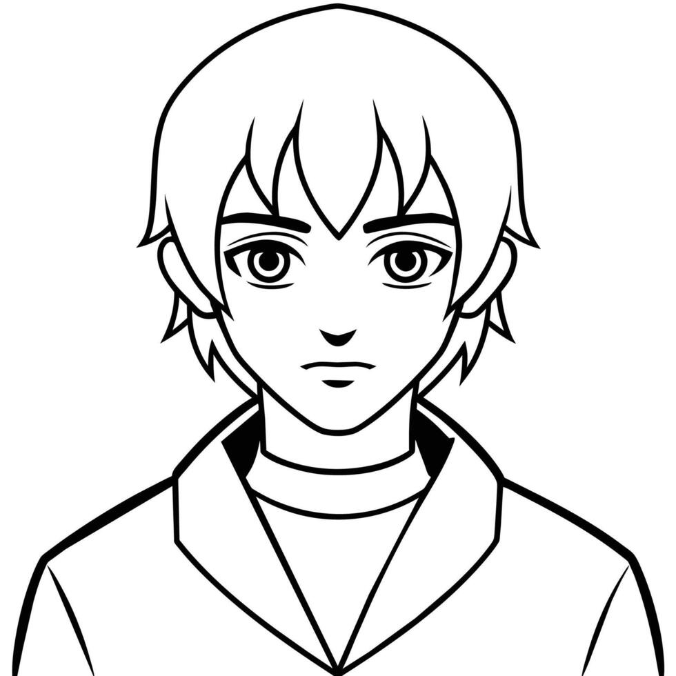

# 🎨🎥 Prompt2Video: Sketch-to-Video with Stable Diffusion, ControlNet, and Identity Consistency

This repository contains a pipeline to generate smooth, identity-consistent videos transitioning a sketch through changing environments using Stable Diffusion, ControlNet, and CLIP models.

## 🚀 Overview

The pipeline takes a user-uploaded sketch and a text prompt describing the scene. It leverages:

- **ControlNet (scribble model)** for sketch-conditioned image generation.
- **Stable Diffusion Img2Img** with LoRA weights for anime-style refinement.
- **CLIP embeddings** to enforce identity consistency between frames.
- **Prompt blending** to smoothly shift the scene (e.g., from sunny to rainy forest).
- **Temporal smoothing** to reduce flickering and ensure fluid transitions.
- Compiles all frames into a final MP4 video.

## ✨ Features

- Generate the first frame from a sketch and text prompt.
- Interpolate prompts to animate scene transitions.
- Preserve visual identity using CLIP-based similarity.
- Retry mechanism ensures quality and consistency.
- Save all generated frames and export them as a video (8 FPS).
- Works directly in Google Colab with download and inline playback.

## 🛠 Requirements

- Python 3.8+
- [diffusers](https://github.com/huggingface/diffusers)
- [transformers](https://github.com/huggingface/transformers)
- [torch](https://pytorch.org/)
- [Pillow](https://pillow.readthedocs.io/en/stable/)
- [imageio](https://imageio.readthedocs.io/en/stable/)
- GPU support (Google Colab or CUDA-enabled environment recommended)

## ⚙️ Setup

Run the notebook `prompt2video.ipynb` in [Google Colab](https://colab.research.google.com/) or locally on a CUDA-enabled machine.

## 📦 Usage

1. Upload your sketch image when prompted.
2. Enter a base prompt (e.g., `"anime style boy"`).
3. The script generates a video transitioning the sketch from a sunny to rainy forest environment.
4. The video is saved, downloaded, and displayed inline.

## 🖼️ Sample Input & 🎬 Output

Here's an example of what the pipeline can do using a simple sketch and a base prompt:

### ✏️ Input

**Sketch:**

**Base Prompt:** "anime style boy"

**Scene Transition:** From sunny forest to rainy forest

### 🎬 Output

The generated video smoothly animates the sketched character through the environmental transition, maintaining visual identity and style:

🔁 The character's appearance remains consistent, while the background and lighting change dynamically over time.

## 📌 Customization

- Change `env_start` and `env_end` to modify environment transitions.
- Adjust `num_frames` and `fps` for video duration and speed.
- Tune `identity_threshold` for stricter or looser identity matching.
- Swap out LoRA weights or use different SD models.

## 👨‍💻 Author

Made with 💚 by **MELOS**
